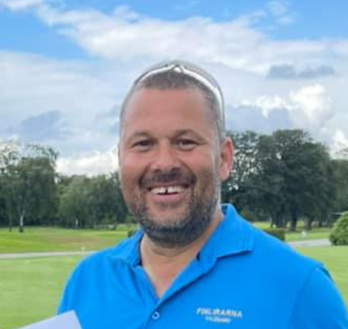

# live-CV

# Michael Broström – Profil

## Personligt
- **Namn:** Michael Broström
- **Tagline:** Engagerad och nyfiken!
- **Kort bio:** Systemprogrammerare i grunden som under de senaste 30 åren arbetat som översättare och skribent. Genomgår nu en planerad kursändring mot Business Intelligence med fokus på att destillera komplex information till tydliga, datadrivna budskap.
- **Kontaktlänkar:**
  - [LinkedIn](https://www.linkedin.com/in/michael-brostrom/)
  - [E-post](mailto:michael@intertec.se) 
  
## BI Analyst med AI-kompetens (400 YH-poäng)
- **Skola:** YH Akademin  
- **Fokusområden:** Alla former av databearbetning och visualisering, från backend (ETL/SQL) till frontend (Power BI/Dashboarding).

## Kunskapsnivåer (1–5)
*Betygsnivån har genomgående varit VG, men kunskaperna är kanske lite grunda*
- **SQL:** 4
- **Python:** 3
- **Power BI:** 4
- **Excel:** 4
- **Visualisering:** 4
- **Statistik:** 4
- **Datamodellering:** 4
- **Machine Learning:** 4
- **IoT/API-data:** 4
- **SSIS:** 4
- **DAX:** 3
- **SSAS:** 3
- **Molnlösningar:** 4
- **Ledarskap & projektmetodik:** 4

## Kursfördelning (%)
*Baserat på utbildningens totalt 400 YH-poäng.*
- **LIA (Praktik):** 25% (100 poäng)
- **ETL, SQL & Databaser:** 20%
- **Dataanalys & Statistik:** 15%
- **Python & Machine Learning:** 15%
- **BI-verktyg & Visualisering:** 15%
- **Molnlösningar:** 5%
- **Ledarskap & Projektmetodik:** 5%

## Systemprogrammerarlinjen
- **Skola:** Högskolan i Skövde 1988–1991
- **Fokusområden:** En hel del överlappning med BI-utbildningen, bl.a. SQL, mycket databasmetodik, diverse programmering, etc.*

## Projekt
1. **AI-optimering för Smart Hem (IoT & AI):** Ett avancerat projekt som kombinerar realtidsdata från en egen solcellsanläggning med externa datakällor som väderprognoser och spotpriser (Day-ahead) från elmarknaden (SE4). Genom att använda Machine Learning (HistGBR) för prediktion och linjärprogrammering (PuLP) för optimering, skapades en intelligent styrningsmodell för att minimera hushållets elkostnader. Projektet gav djupa insikter i systemintegration och visade på hur smart mjukvarustyrning kan påverka kalkylen för investeringar i hårdvara som hushållsbatterier. [Läs mer här](https://intertec.se/elprojekt_presentation.html). 
2. **MNIST-modellering – Från teori till färdig app (Machine Learning):** En omfattande djupdykning i bildklassificering och prediktering av handskrivna siffror. Projektet innefattade utvärdering av flera algoritmer, såsom KNN och Random Forest, där valet slutligen föll på en optimerad Support Vector Classifier (SVC). Fokus låg på avancerad bildbehandling (preprocessing), inklusive dimensionsreducering, dataaugmentering och matematisk centrering av siffermassa för att matcha träningsdata. Resultatet blev en interaktiv webbapplikation där användaren kan rita siffror eller ladda upp bilder för analys, komplett med en feedbackfunktion för framtida modellförbättring. [Se videopresentation och kod här](https://youtu.be/O-3N8rNN_EU)
3. **Verksamhetsstyrning och visualisering (Power BI):** Slutprojektet i kursen "BI-verktyg och verksamhetsprocesser" fokuserade på att transformera komplexa affärsbehov till en interaktiv analyslösning. Efter 30 år som skribent innebar detta projekt en framgångsrik övergång till teknisk datamodellering och visualisering, vilket resulterade i en integrerad dashboard för fyra affärsområden:
    * **Ekonomi:** Implementerade en dynamisk resultaträkning per månad och år (inklusive YTD) med uppföljning av nyckeltal som TB1, TB2, HR-kostnader och resultatmarginaler.
    * **Försäljning:** Skapade detaljerade vyer för försäljning och marginaler i kronor och procent, med drill-down-funktionalitet från hela affären ner till enskild varugrupp och artikel. Inkluderade även trendanalys över tid och identifiering av "Topp 5/Botten 5" produkter.
    * **Kampanjanalys:** Utvecklade modeller för att följa upp vilka produkter som ingick i specifika kampanjer, dess intäkter, rabattsatser och förlustanalys jämfört med ordinarie priser för att utvärdera kampanjernas effektivitet.
    * **HR-rapport:** Visualiserade personalstyrkan baserat på demografi såsom kön och ålder, anställningstyper och löner  samt analyserade korrelationen mellan arbetade timmar, anställningstid och löneutveckling.
Genom att kombinera affärslogik med användarvänlig design visade projektet hur data kan göras begriplig och beslutsunderlag tydliga.

## Erfarenheter
1. **LIA-praktik** Ett flertal Business Intelligence-uppgifter på Intersolia i Halmstad.
2. **Copywriter & Översättare:** Lång erfarenhet av kravfångst från beställare och att omvandla komplex data till mätbar effekt för specifika målgrupper.
3. **Projektledare Microsoft WPGI:** Ansvarade för lokalisering av Office-paketet för Mac, vilket inkluderade hantering av komplexa ordlistor och style guides.

## Profilbild
